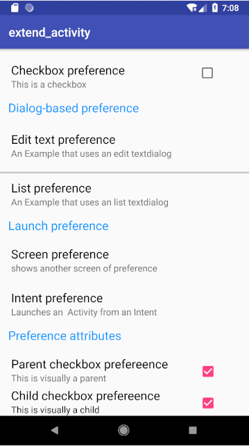

extend_activity

In-line preferences(CheckBoxPreference)

Dialog-based preferences:

(EditTextPreference      ListPreference)

Launch preferences  :

(PreferenceScreen: 跳转到另一个PreferenceScreen

PreferenceScreen: 启动一个网页)

Preference attributes  

(CheckBox: 父选项

CheckBox: 子选项，当父选项勾选时呈现)

